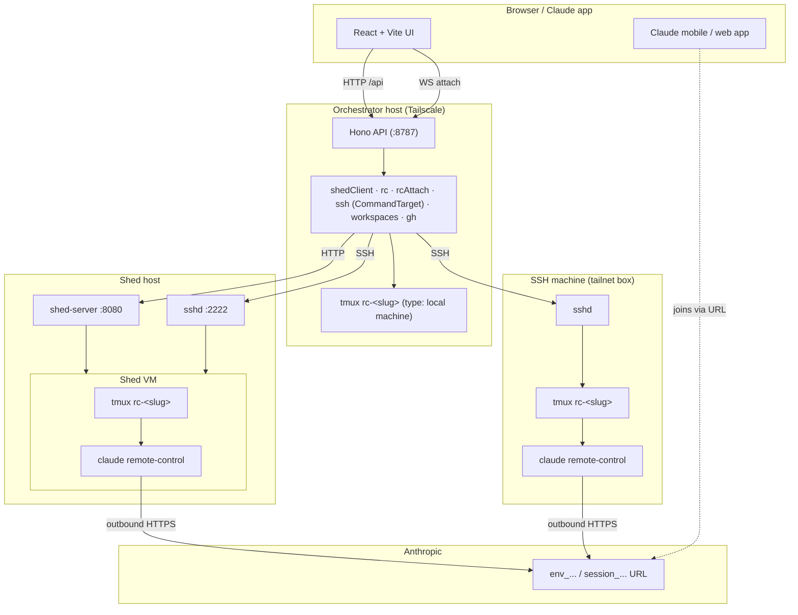

# Architecture

## Components



## Request paths

### List sheds

`GET /api/sheds` fans out across all hosts in parallel with `Promise.allSettled`. Per-host failures are returned under `errors[]` so the UI can show a partial list without blocking.

See `apps/api/src/routes/sheds.ts`.

### Create shed (SSE)

Hono's `streamSSE` proxies the upstream `shed-server` SSE stream straight through:

```
browser ─POST /api/sheds/:host─▶ backend ─POST /api/sheds (SSE)─▶ shed-server
        ◀───────── passthrough ────────────────────────────────────
```

The backend does not buffer — each `event:` + `data:` pair is flushed to the browser as soon as it arrives. The shared parser in `packages/shared/src/sse.ts` handles chunk boundaries, multi-line data, comment keep-alives, and trailing-event flush.

### Bootstrap remote-control

The same code path serves sheds, SSH machines, and local machines. The polymorphism lives in `CommandTarget`:

```ts
type CommandTarget =
  | { kind: 'ssh'; host: string; user: string; port: number }
  | { kind: 'local' };
```

`run(target, argv, opts)` and `openAttach({target, …})` dispatch on `kind`. For `'ssh'` they spawn the real `ssh` CLI; for `'local'` they spawn `bash -c` (and `tmux attach` for the attach path) directly. The wire command is built the same way in both branches (each token pre-quoted with `shellQuote`) so the local shell parses it byte-for-byte the way the remote shell does.

```mermaid
sequenceDiagram
    participant UI
    participant API
    participant T as Target<br/>(ssh or local)
    participant TMUX as tmux + claude

    UI->>API: POST /api/{sheds|machines}/.../rc
    Note over API: target = CommandTarget<br/>(ssh: spawn ssh; local: spawn bash)
    API->>T: tmux new-session -d -s rc-&lt;slug&gt; …
    T->>TMUX: detached session
    loop Every 750ms (≤ 20s)
        API->>T: tmux capture-pane
        T-->>API: pane text
        API->>API: classifyPane(kind, pane) → state/url
    end
    API-->>UI: { kind, state, url, target, … }
```

Classifier regex table: see [Remote Control](../reference/remote-control.md#classifier-regexes).

### Browser terminal attach

```mermaid
sequenceDiagram
    participant XT as xterm.js
    participant WS as API WS upgrade
    participant T as Target

    XT->>WS: GET /api/.../rc/:slug/attach (Upgrade: websocket)
    WS->>WS: origin check (CORS_ORIGINS)
    WS->>T: spawn `tmux attach -t rc-&lt;slug&gt;` (ssh -tt or direct)
    T-->>WS: PTY bytes
    WS-->>XT: binary frames
    XT->>WS: keystrokes (binary), resize (JSON)
    WS->>T: writes to PTY / resize PTY
    T-->>WS: process exits
    WS-->>XT: { type: 'exit', code }
```

## Load-bearing modules

| Module | Purpose |
|--------|---------|
| `apps/api/src/lib/shedClient.ts` | Typed HTTP client for `shed-server` (incl. SSE create) |
| `apps/api/src/lib/rc.ts` | Bootstrap / probe / kill / classifyPane / listRcSessions (all polymorphic on `CommandTarget`) |
| `apps/api/src/lib/rcAttach.ts` | WebSocket PTY bridge to `tmux attach` (SSH or local) |
| `apps/api/src/lib/ssh.ts` | `CommandTarget` union + `run()` (Bun.spawn ssh or bash) + stderr classifier |
| `apps/api/src/lib/machineClients.ts` | `machineCommandTarget(m)` → `CommandTarget` for the machine routes |
| `apps/api/src/lib/shell.ts` | POSIX-safe shell quoting (shared by ssh and local wire paths) |
| `apps/api/src/lib/cache.ts` | `ttlMemoize<K, V>` — keyed cache with in-flight dedup |
| `apps/api/src/lib/errors.ts` | Unified `AppError` used everywhere |
| `apps/api/src/lib/configStore.ts` | Memoized loaders for both YAML configs |
| `apps/api/src/lib/appConfig.ts` | Zod schema for `~/.config/shed-remote-agent/config.yaml`, including the `machines[]` discriminated union |
| `apps/api/src/lib/workspaces.ts` | `ls + .git` probe in one SSH round-trip; falls back to in-process `readdir` for `ssh: null` (local-host / local-machine listing) |
| `apps/api/src/lib/gh.ts` | `gh repo list` wrapper + cache |
| `packages/shared/src/sse.ts` | Shared SSE line parser (server + browser) |

## Error flow

Library code throws `AppError(code, message, statusCode)`. The global `errorHandler` in `apps/api/src/middleware/error.ts` formats both `AppError` and `ZodError` into the `{error: {code, message, details?}}` shape. Upstream `shed-server` errors carry through with the upstream status code preserved.

## Frontend data flow

- **TanStack Query** for server state with short `staleTime` and a uniform `POLL_MS = 10_000` on the detail page.
- **Zustand** is included in deps but unused in MVP — reserved for local UI state that survives navigation.
- **Mutations** invalidate the affected query keys in `onSuccess`; toasts handle user feedback.
- **SSE** for create-shed uses a hand-rolled `ReadableStream` reader (`apps/web/src/lib/sse.ts`), which in turn delegates to the shared `parseSSEStream`.
