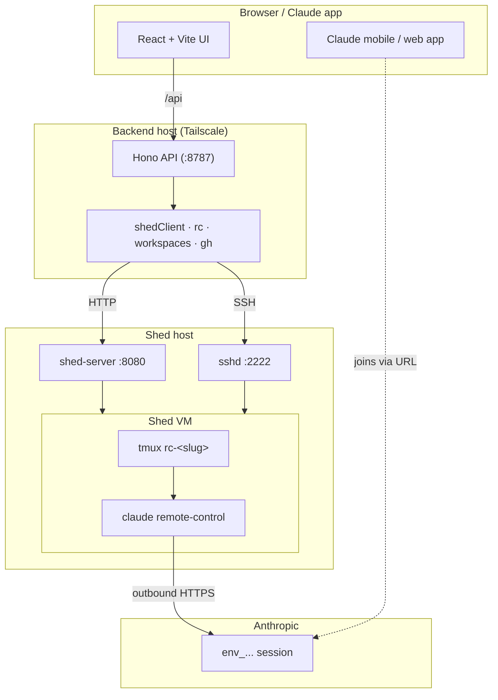

# Architecture

## Components



## Request paths

### List sheds

`GET /api/sheds` fans out across all hosts in parallel with `Promise.allSettled`. Per-host failures are returned under `errors[]` so the UI can show a partial list without blocking.

See `apps/api/src/routes/sheds.ts`.

### Create shed (SSE)

Hono's `streamSSE` proxies the upstream `shed-server` SSE stream straight through:

```
browser ─POST /api/sheds/:host─▶ backend ─POST /api/sheds (SSE)─▶ shed-server
        ◀───────── passthrough ────────────────────────────────────
```

The backend does not buffer — each `event:` + `data:` pair is flushed to the browser as soon as it arrives. The shared parser in `packages/shared/src/sse.ts` handles chunk boundaries, multi-line data, comment keep-alives, and trailing-event flush.

### Bootstrap remote-control

```mermaid
sequenceDiagram
    participant UI
    participant API
    participant SSH as shed-server SSH
    participant VM as Shed VM

    UI->>API: POST /api/sheds/:host/:name/rc
    API->>SSH: ssh <shed>@<host>:2222 -- bash -lc '…'
    Note right of API: tmux new-session -d -s rc-&lt;slug&gt; …
    SSH->>VM: tmux + claude remote-control
    loop Every 750ms (≤ 20s)
        API->>SSH: ssh -- tmux capture-pane
        SSH-->>API: pane text
        API->>API: classifyPane() → state/url
    end
    API-->>UI: { state: 'ready', url: 'https://claude.ai/code?…' }
```

Classifier regex table: see [Remote Control](../reference/remote-control.md#classifier-regexes).

## Load-bearing modules

| Module | Purpose |
|--------|---------|
| `apps/api/src/lib/shedClient.ts` | Typed HTTP client for `shed-server` (incl. SSE create) |
| `apps/api/src/lib/rc.ts` | Bootstrap / probe / kill / classifyPane |
| `apps/api/src/lib/ssh.ts` | `Bun.spawn(['ssh', …])` wrapper with timeout + stderr classifier |
| `apps/api/src/lib/shell.ts` | POSIX-safe shell quoting |
| `apps/api/src/lib/cache.ts` | `ttlMemoize<K, V>` — keyed cache with in-flight dedup |
| `apps/api/src/lib/errors.ts` | Unified `AppError` used everywhere |
| `apps/api/src/lib/configStore.ts` | Memoized loaders for both YAML configs |
| `apps/api/src/lib/workspaces.ts` | `ls + .git` probe in one SSH round-trip |
| `apps/api/src/lib/gh.ts` | `gh repo list` wrapper + cache |
| `packages/shared/src/sse.ts` | Shared SSE line parser (server + browser) |

## Error flow

Library code throws `AppError(code, message, statusCode)`. The global `errorHandler` in `apps/api/src/middleware/error.ts` formats both `AppError` and `ZodError` into the `{error: {code, message, details?}}` shape. Upstream `shed-server` errors carry through with the upstream status code preserved.

## Frontend data flow

- **TanStack Query** for server state with short `staleTime` and a uniform `POLL_MS = 10_000` on the detail page.
- **Zustand** is included in deps but unused in MVP — reserved for local UI state that survives navigation.
- **Mutations** invalidate the affected query keys in `onSuccess`; toasts handle user feedback.
- **SSE** for create-shed uses a hand-rolled `ReadableStream` reader (`apps/web/src/lib/sse.ts`), which in turn delegates to the shared `parseSSEStream`.
