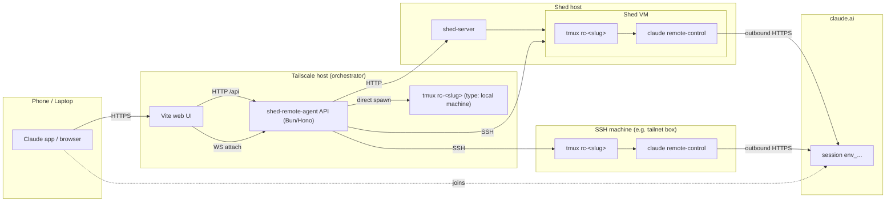

# shed-remote-agent

A mobile-first web UI that browses [sheds](https://github.com/charliek/shed) across configured hosts and bootstraps [`claude remote-control`](https://code.claude.com/docs/en/remote-control) sessions inside them. Pair it with the Claude mobile, web, or desktop app to pick up a coding session from anywhere on your Tailscale network.

## Features

- **List sheds across all hosts** discovered from `~/.shed/config.yaml`
- **Create a new shed** with a git repo (gh-backed picker) or a host-side local directory
- **Native machines as RC targets** alongside sheds. SSH machines (e.g. Tailscale-reachable boxes) and `type: local` machines that run on the orchestrator host itself with no SSH hop
- **Three RC kinds**: `agent` (cloud-driven broker), `repl` (interactive `claude` REPL with `/rc`), and `shell` (plain login bash). Default is `repl`
- **Bootstrap `claude remote-control`** in `/workspace` of any running shed (or in a configured workdir on a machine) over SSH + tmux
- **In-browser xterm.js terminal** that attaches to the underlying tmux session over a WebSocket, with PTY resize and keep-alive
- **Actionable state surface**: `starting`, `ready`, `reconnecting`, `needs-trust`, `needs-auth`, `dead` — no more guessing why a session isn't connected
- **One-tap open** of the generated `https://claude.ai/code?environment=env_...` URL in the Claude app

## Architecture

The backend fans out to every `shed-server` listed in `~/.shed/config.yaml`, streams create-shed SSE progress through to the browser, and uses SSH + `tmux` + `claude remote-control` to produce a joinable session URL. Native machines configured in `~/.config/shed-remote-agent/config.yaml` get the same RC UX — either over SSH or, for `type: local` machines, by spawning tmux directly on the orchestrator host with no SSH hop. The web UI's in-browser terminal connects to either target over a WebSocket.

## Requirements

| Component | Requirements |
|-----------|--------------|
| Backend host | [Bun](https://bun.com) ≥ 1.0 (this is where the API + web run) |
| Shed hosts | A running [`shed-server`](https://github.com/charliek/shed) reachable from the backend host |
| Auth | None in-app. Deploy the backend behind [Tailscale](https://tailscale.com) (or an equivalent private network) |
| Optional | [`gh`](https://cli.github.com) (for the repo picker) and a GitHub account for Claude subscription |

## Quick Links

- [Installation](getting-started/installation.md) — Get the backend + UI running
- [Configuration](getting-started/configuration.md) — The two config files
- [Quick Start](getting-started/quick-start.md) — First shed, first remote-control session
- [HTTP API](reference/http-api.md) — Every endpoint the backend exposes
- [Remote Control](reference/remote-control.md) — The six states and what to do about each
- [Development Setup](development/setup.md) — Hack on the code
- [Roadmap](ROADMAP.md) — What's intentionally deferred

## Security Model

No auth in the app by design. It is meant to live on a Tailscale-gated host where network access already implies trust. Do not expose it to the public internet.
